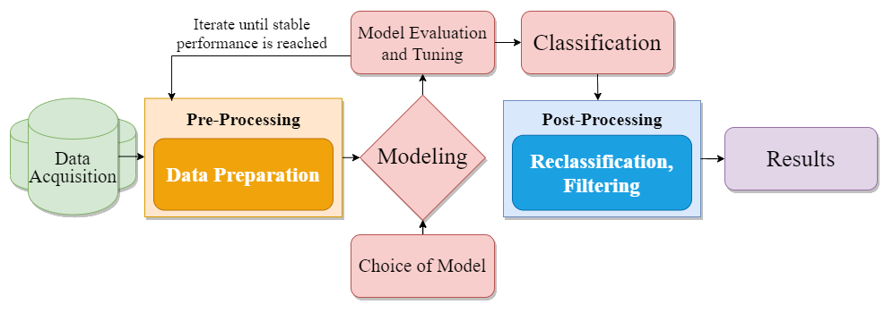

# Day 1 - Welcome, Raster stacking, sampling of training data

## During today's class you will learn... 

  - how to create a raster stack of several satellite image bands, a form of pre-processing in R.
  - how to automate that process (batch processing) for an arbitrary amount of images in R.
  - how to create training/validation data samples in QGIS. 

## At home you are supposed to...
  - wrap up the creation of your training samples.
  - refresh your memory on how to visualize and interpret remote sensing imagery.
  - read about basic Machine Learning concepts. 
  
## Tomorrow we will...
  - learn how to visualize raster images in R
  - extract our training samples' spectral signature into a dataframe
  - fit our Random Forest model and perform image classification
---

# Part 0: Introduction

# Part 1: Raster stacking and batch processing in R
Landsat 8 remote sensing data is provided as individual georeferenced **.tif** images based on their spectral bands. In this task we would like to stack these images into a single geotiff-file, a so-called **_raster stack_**.  

**What is a raster stack and why do we need it?**

A raster stack is essentially a stack of multiple raster layers that share the same spatial extent. While remote sensing imagery can be composed to a single raster image (e.g. true color composite, false color composite) it is essentially an array of different rasters, the so-called bands. Each band corresponds to the electromagnetic energy of a certain wavelength captured by the sensor. Some bands reflect colors that we, as humans, are able to visualize, such as red, green or blue but the majority of bands is usually outside of the perceivable spectrum. While having all the different bands of an image as seperate rasters/images can be fine in some cases, quite a lot of operations involved in image classification involv more than one band or even all bands at once. Thus, we need a way to refer to the whole array of images/bands - a raster stack. While we could stack our rasters in QGIS, we will use R for this pre-processing operation, because it is easier to automate things this way. For those of you who already performed image classification using the SCP plugin in QGIS, the raster stack is similar to a band set.

This first assignment is separated in two parts:
First, we manually create a raster stack out of a single Landsat-8 scene.
Second, we automate this process using a loop, so that we can create raster stacks out of more than one L8 scenes at once (batch processing).

[Link to the R code](./01_01_RasterStacking.R)

# Part 2: Creating training samples in QGIS

Now that we have prepared our raster data, we need to create training samples in QGIS. 

**What the heck are training samples?**

Supervised algorithms generally make use of training data to, well, train their classification mechanisms. Simply put, the algorithms needs a reference for the classes you want them to distinguish. An example: If you want to classify forests and urban fabric, your the algorithm needs to be fed the spectral signatures of forest and urban pixels. Apart from tuning an algorithm's working parameters (hyperparameters), the selection of training data is one of the few ways, we, as users, can influence the classification outcome. Thus, the creation/selection of training data is a major part of any attempted supervised classification. The general idea is to create many polygons in QGIS and save them as a vector file. Each of the polygons should cover only a single, spectrally distinct land cover class e.g. forest, meadow, water... Then, we import our training areas to R to extract the spectral signatures of the pixels they cover. 

[Link to the PDF assignment](./01_02_SamplingQGIS.pdf)

Answer these questions to prove your knowledge:
- Sum up the requirements to optimally generate training samples!

>YOUR ANSWER HERE

- Briefly summarize how to approach the amount of training data you need!

>YOUR ANSWER HERE

# @Home: Read about image visualization and Machine Learning
1. If you didn't finish creating your training samples during the designated course time, we recommend to wrap this up now. 
2. Please have a look at [this short explanation](01_H_ImageVisualization.pdf) of concepts relevant to the visualization of remote sensing imagery. Ideally, this should be  repetition but realizing that digital images are essentially nothing but matrices filled with digits is rather important to reach an understanding of statistical methods of image classification.
3. Also skip through [this introduction to Random Forests and other Machine Learning concepts](01_H_MachineLearningBasics.pdf). You do not need to become computer scientists to finish this course but a fundamental understanding of the algorithm we are working with is somewhat required. We are aware that these concepts are out of the comfort zone of many Geographers, so feel free to ask questions on Slack and during the course.

You may use these questions to test your understanding:
- Why do we use machine learning methods in remote sensing?

>YOUR ANSWER HERE

- What is the difference between supervised and unsupervised algorithms?

>YOUR ANSWER HERE

- Define the Out-Of-Bag (OOB) error using your own words.

>YOUR ANSWER HERE

